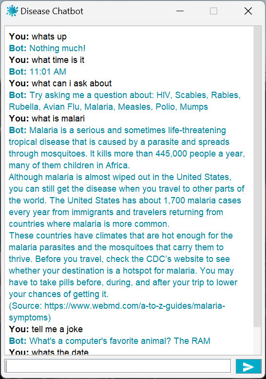

# CSCE240H Final Project

## Disease Chatbot

This chatbot allows the user to chat with an AI to learn more about various diseases.
The currently supported diseases are:
- HIV
- Scabies
- Rabies
- Rubella
- Avian Flu
- Malaria
- Measles
- Polio
- Mumps

## Usage
Download the DiseaseChatbot.jar file. Run this file by simply opening the .jar file.

If the application doesn't open directly, the .jar file can also be run from the terminal. Navigate to the directory where the DiseaseChatbot.jar file is stored, and run `java -jar DiseaseChatbot.jar`. 

## DiseaseChatbotProject Folders
### src
##### DiseaseWebScraper.java
Parses disease information from WebMD and CDC websites for certain diseases. (Project 1)
##### DiseaseDataProcessor.java
Processes information for a provided disease and attempts to identify and answer prompts based on the stored information for that disease. (Project 2)
##### DiseaseChatBot.java
Uses DiseaseWebScraper and DiseaseDataProcessor to take user input regarding a disease and generates a response. Also accounts for some general "small talk" questions. (Project 3)
##### ChatBot.java
Interface to represent a chatbot. The bot must provide a method to able to take a String user entry and provide a String response. (Project 3)
##### ChatBotGui.java
Takes an implementation of the ChatBot interface and creates a simple, customizable GUI for the user to enter input and see the ChatBot responses. (Project 3)
##### SpellingCorrector.java
Provides a simple API for using Jazzy to correct text based on the provided dictionary file. (Project 4)
##### DiseaseChatbotLauncher.java
Launches GUI and prints chat session statistics and text to files in log. (Project 5)
##### SessionLogger.java
Summarizes recorded chat session statistics and text from the log folder. (Project 5)
### data
Contains the text files generated for each disease from DiseaseWebScraper and read by DiseaseDataProcessor. 
### dictionary
Contains a text file of keywords to use for spell correcting by SpellingCorrector
### lib
Contains external libraries used in project.
### images
Contains images used by the project.
### presentation slide deck
#### Presentation Slide Deck
https://docs.google.com/presentation/d/1fFr2-i-6zMFYh8_DxckJRt1J-nNd3CwKIOQkzDwKUn0/edit#slide=id.p 
